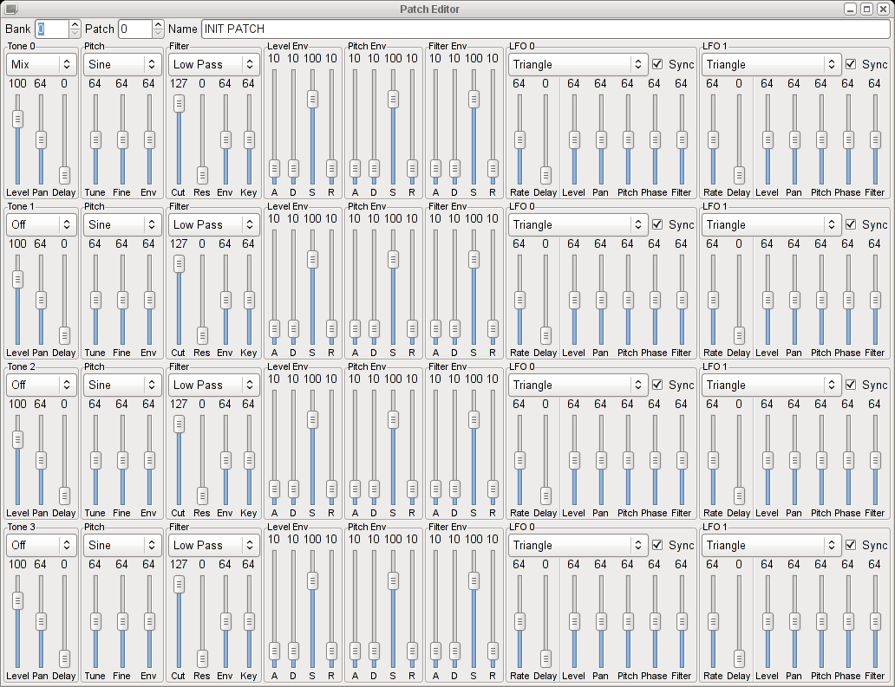

# LibSNTH and SNTHGUI

LibSNTH is a polyphonic, multitimbral, software synthesizer implemented using Intel Streaming SIMD Extensions. It supports subtractive synthesis, frequency modulation, phase modulation and ring modulation. It provides four oscillators per voice, each with a filter and two low-frequency oscillators. As a traditional MIDI synthesizer, it allows 16 channels and 256 banks of 256 patches. It is fully configurable via MIDI SysEx messages. LibSNTH is well-encapsulated and completely OS-agnostic. On modern hardware, LibSNTH supports tens of thousands of simultaneous voices, all of them generated and filtered in real time.

SNTHGUI is a GTK+ patch design tool accompanying LibSNTH. It uses ALSA for PCM output and MIDI routing, so it's Linux-specific. It serves as a comprehensive example of the use of the LibSNTH API and demonstrates the integration of LibSNTH with an application. The GUI, which exposes every aspect of the LibSNTH API, looks like this:

I wrote this code under Debian Linux in December 2005 and haven't touched it since. It still compiles and runs correctly under modern Linux distributions. It was a work-in-progress in 2005, but is very close to feature complete. It may be of some value as an embedded synthesizer for game audio.

## MIDI Setup

SNTHGUI is designed to be triggered by an external MIDI device. In the absence of MIDI hardware, a virtual keyboard may be used. Here is the procedure to configure ALSA's MIDI routing to connect the venerable X11 virtual keyboard tool `vkeybd` to SNTHGUI:

Run `vkeybd` in the background.

    vkeybd &

Query the available ALSA input connections.

    $ aconnect -i
    client 0: 'System' [type=kernel]
        0 'Timer           '
        1 'Announce        '
    client 14: 'Midi Through' [type=kernel]
        0 'Midi Through Port-0'
    client 128: 'Virtual Keyboard' [type=user]
        0 'Virtual Keyboard'

We see `vkeybd` on client 128.

Run SNTHGUI in the background.

    snthgui &

Query the available ALSA output connections.

    $ aconnect -o
    client 14: 'Midi Through' [type=kernel]
        0 'Midi Through Port-0'
    client 129: 'LibSNTH GUI' [type=user]
        0 'LibSNTH GUI     '

We see SNTHGUI on client 129.

Connect input 128 to output 129.

    $ aconnect 128 129

Now, pressing keys on the virtual keyboard will cause SNTHGUI to synthesize tones and send them to the ALSA PCM audio output.
